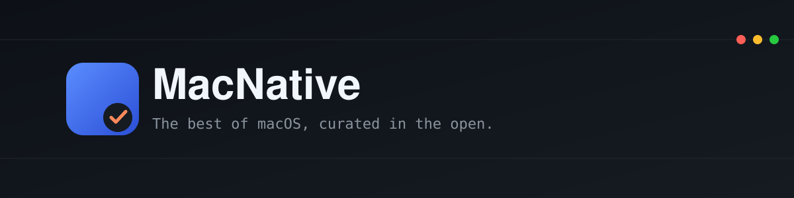

  

  
  
  

MacNative is a hand-picked directory of macOS apps that are genuinely native — built with AppKit or SwiftUI, not a web page wearing a dock icon. Nobody pays to be listed, there's no algorithm, and we don't try to catalogue everything.

This organization is the open half of that work: the tools we use to do the research, and the lists we'd want to exist ourselves. Everything here is free to use, fork, and send a pull request against.

## What we're building

- **[electron-detector](https://github.com/macnative/electron-detector)** — One command that scans your `/Applications` folder and tells you which of your "native-feeling" apps are secretly running a full Chromium browser, with sizes, versions, and native alternatives. No install, no dependencies, nothing left behind.
- **[awesome-mac-workflows](https://github.com/macnative/awesome-mac-workflows)** — A cookbook of macOS workflows — Shortcuts, Alfred workflows, Raycast extensions, Keyboard Maestro macros, and Finder Quick Actions — organized by the outcome they get you, not the app that runs them.
- **[awesome-ai-apps](https://github.com/macnative/awesome-ai-apps)** — Curated AI-powered desktop apps for macOS, Windows, and Linux: chat, coding, writing, media, local LLMs, and agents. Every entry is a real installable desktop app, not a web wrapper.
- **[awesome-mac-launch-platforms](https://github.com/macnative/awesome-mac-launch-platforms)** — Free and paid places to launch a macOS app: directories, subreddits, other awesome-lists, and newsletters, with real pricing and submission notes.

## How we decide what's good

The same bar [macnative.io](https://macnative.io) uses applies here: does it respect system conventions, with real menus and keyboard shortcuts? Does it behave properly in full screen and Stage Manager? Is it actually maintained? We'd rather list fewer things and be right about them than catalogue everything. The full criteria are written up in [How We Pick Apps for MacNative](https://macnative.io/blog/how-we-pick-apps).

## Contributing

Each repository has its own `CONTRIBUTING.md` with the specific format we're looking for — issues and pull requests are welcome across all of them. Found a native app that deserves a spot in the directory itself? [Submit it here](https://macnative.io/submit).

---

<a href="https://macnative.io">macnative.io</a> · <a href="https://macnative.io/blog">blog</a> · <a href="https://x.com/best_macapps">@best_macapps</a>

